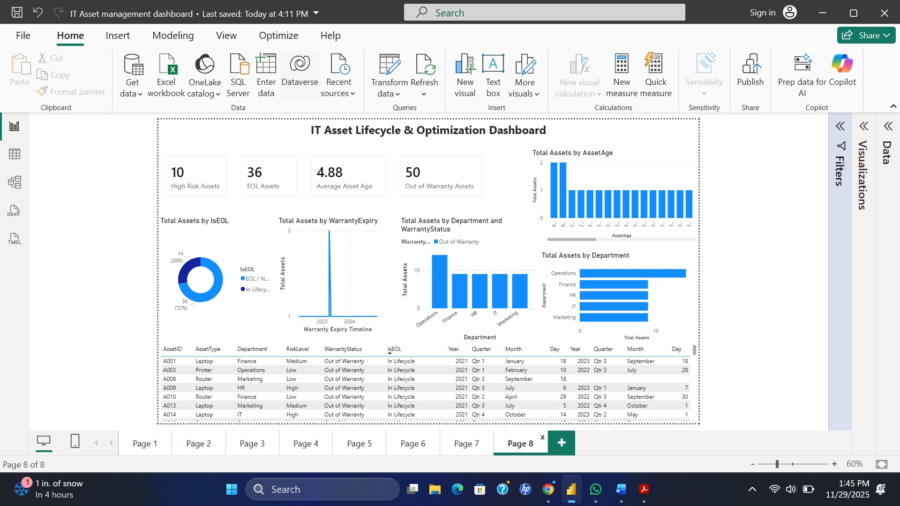

# IT-Asset-Management-PowerBI-Dashboard
Power BI IT Asset Management Dashboard with lifecycle, warranty, risk, utilization, and cost analysis using DAX and Power Query.

A complete IT Asset Lifecycle, Warranty, Utilization, and Cost Analysis Dashboard

This project showcases a full IT Asset Management (ITAM) analytics solution created in Microsoft Power BI, using a Kaggle dataset to simulate a real enterprise environment.
It demonstrates strong skills in:

Data modeling

Power Query transformation

DAX measures

KPI development

Dashboard design

IT lifecycle analytics (EOL, Warranty, Risk, Utilization)

Project Overview

IT departments rely on accurate asset insights to:

Maintain compliance

Optimize asset usage

Reduce unnecessary spending

Monitor warranty and lifecycle risk

Improve decision-making

This Power BI dashboard provides a complete end-to-end analysis of hardware & software assets across departments.
It includes two pages:

Dashboard Pages
PAGE 1 — Executive Summary Dashboard

A high-level overview of asset inventory, utilization, lifecycle, and cost.

Key Features

✔ Total asset count
✔ Active vs. Inactive assets
✔ Underutilized assets
✔ End-of-Life (EOL) forecast
✔ Out-of-warranty assets
✔ Total cost summary
✔ Department-level and Asset Type distribution
✔ Warranty status breakdown
✔ Cost trends over years

Visuals Included

KPI Cards (Total, Active, EOL, Underutilized, Out-of-Warranty, Total Cost)

Assets by Department

Assets by Asset Type

Warranty Status Donut

Total Cost by Year (line chart)

Filters for Department, Location, AssetType, Status, RiskLevel

PAGE 2 — Lifecycle & Optimization Dashboard

A deep-dive page focused on risk, lifecycle, and warranty forecasting.

Key Features

✔ Asset Lifecycle distribution (In Lifecycle vs EOL)
✔ Warranty risk by department
✔ Warranty expiry timeline
✔ Asset age distribution
✔ Underutilized assets by business units
✔ High-risk asset matrix (detailed table)

Visuals Included

KPI cards (High Risk, EOL Assets, Avg Age, Out-of-Warranty)

Lifecycle donut chart

Warranty risk by department

Warranty expiry timeline

Asset Age distribution

Underutilized assets chart

High-risk asset table (AssetID, Type, Dept, Risk, Warranty, EOL, Dates)

Technical Skills Demonstrated
Power BI Skills

Power Query cleaning & normalization

Data modeling (relationships, star schema)

DAX (KPIs, time-intelligence, calculated columns)

Custom measures for lifecycle, warranty, utilization

Slicers, grouping, drill-through, interactive visuals

Professional dashboard layout & UX design

IT Domain Skills

IT Asset Lifecycle Management

Warranty & compliance analysis

Asset utilization monitoring

EOL forecasting

Department & AssetType cost allocation

Risk-level categorization

ITAM/CMDB fundamentals

⚙️ Data Modeling

cleaned_asset_management_data	Main asset dataset (IDs, Type, Dept, Cost, Warranty, Risk, Dates)
DateTable	Custom calendar table for time intelligence (Year, Month, YearMonth)
Relationship
DateTable[Date]  ➝  cleaned_asset_management_data[PurchaseDate]

it-asset-management-powerbi-dashboard/
│
├── IT_Asset_Management.pbix
├── README.md
├── assets/
│     ├── dashboard_page1.png
│     ├── dashboard_page2.png
│     └── kpi_summary.png

